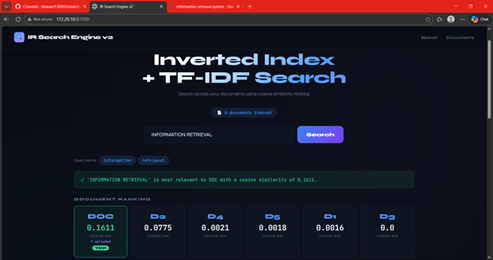
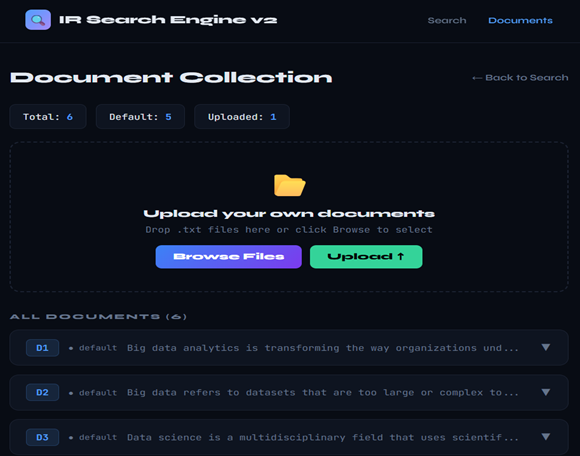

#  IR Search Engine v2

> A Flask web application implementing a Search Engine using **Inverted Index**, **TF-IDF Ranking**, and **Cosine Similarity** — with support for user-uploaded documents.


---

##  Live Demo

**[https://web-production-aa438.up.railway.app/]**

---

## Screenshots

### Search Page


### Search Results with TF-IDF Tables


### Document Upload & Manager


---

## ✨ Features

-  Search across documents using **TF-IDF + Cosine Similarity**
- **Inverted Index** construction from document collection
- **Upload your own `.txt` documents** dynamically
- **Delete uploaded documents** from the collection
- View all calculation tables — Inverted Index, TF, IDF, TF-IDF, Query Vector
- 5 default documents included out of the box
- Deployed live on Railway

---

## 🛠️ Tech Stack

| Layer | Technology |
|---|---|
| Backend | Python 3.10, Flask 3.0.3 |
| Frontend | HTML5, CSS3, JavaScript |
| IR Logic | math, collections (built-in) |
| Version Control | Git & GitHub |
| Deployment | Railway |

---

## 📁 Project Structure

```
search_engine_v2/
├── app.py                  # Main Flask app + IR logic
├── Procfile                # Railway deployment config
├── requirements.txt        # Dependencies
├── README.md
├── .gitignore
├── default_docs/           # Default document collection
│   ├── d1.txt
│   ├── d2.txt
│   ├── d3.txt
│   ├── d4.txt
│   └── d5.txt
├── uploads/                # User-uploaded files
└── templates/
    ├── index.html          # Search interface
    └── documents.html      # Document viewer + upload UI
```

---

## Installation & Run Locally

**1. Clone the repository**
```bash
git clone https://github.com/bhavani130905/search-engine_v2.git
cd search-engine_v2
```

**2. Install dependencies**
```bash
pip install -r requirements.txt
```

**3. Run the application**
```bash
python app.py
```

**4. Open in browser**
```
http://127.0.0.1:5000
```

---

## How It Works

```
User Query
    ↓
Preprocessing (lowercase + stopword removal)
    ↓
Inverted Index Lookup
    ↓
TF-IDF Weight Calculation
    ↓
Cosine Similarity Scoring
    ↓
Ranked Document Results
```
## How It Works

1. Load default + uploaded documents
2. Preprocess — lowercase, remove stopwords
3. Build Inverted Index
4. Calculate TF, IDF, TF-IDF
5. Convert query to TF-IDF vector
6. Rank documents by Cosine Similarity

| Step | Formula |
|---|---|
| Term Frequency | TF = count of term in document |
| Inverse Document Frequency | IDF = log₁₀(N / DF) |
| TF-IDF Weight | TF-IDF = TF × IDF |
| Cosine Similarity | cos(θ) = (A·B) / (|A| × |B|) |

---

## Deployment

Deployed on **Railway** — [railway.app](https://railway.app)

Steps followed:
1. Added `Procfile`: `web: python app.py`
2. Configured `PORT` environment variable in `app.py`
3. Connected GitHub repo to Railway
4. Generated public domain from Railway Settings

---

---

## References

- Manning, Raghavan & Schütze — *Introduction to Information Retrieval*, Cambridge University Press
- [Flask Documentation](https://flask.palletsprojects.com/)
- [Railway Documentation](https://docs.railway.app/)
## Done under assignment for Information Retrieval